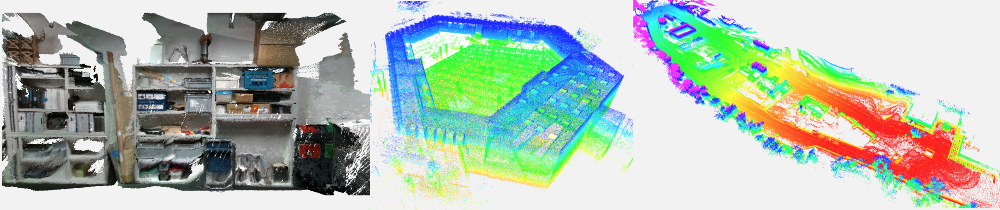

# Open3D SLAM: A Flexible Pointcloud-based SLAM System for Education

open3d_slam is a C++ library for point-cloud SLAM with ROS integration.

**Main Contact:** Edo Jelavic ([jelavice@ethz.ch](mailto:jelavice@ethz.ch?subject=[GitHub]))

**Authors:** [Edo Jelavic](https://rsl.ethz.ch/utils/search.MjAyNjMy.html), [Julian Nubert](https://juliannubert.com/), [Marco Hutter](https://rsl.ethz.ch/the-lab/people/person-detail.MTIxOTEx.TGlzdC8yNDQxLC0xNDI1MTk1NzM1.html)

**Poster and Abstract:** [link](https://www.research-collection.ethz.ch/handle/20.500.11850/551852)

**Documentation:** [link](https://open3d-slam.readthedocs.io/en/latest/)




The main difference between open3d_slam and other SLAM libraries out there is that open3d_slam was designed
to be simple and used for education purposes. In fact, open3d_slam uses only well-established algorithms in their basic form.
We hope that this will make it easier for newcomers to enter the field. It works with pointclouds, no additional input such as IMU is required. Open3D_slam can build a map from scratch or localize in a given map. The given map can also be extended with new measurements.

We base our implementation on [Open3D](http://www.open3d.org/), a well-maintained and highly performant library for
3D data processing.

The documentation and example datasets can be found here [open3d_slam Documentation](https://open3d-slam.readthedocs.io/en/latest/).

## Build

This repository now targets ROS 2 Jazzy only. The active container and documentation assume Jazzy, and the shipped parameter files are plain YAML instead of Lua dictionaries.

```bash
mkdir -p ~/open3d_slam_ws/src
cd ~/open3d_slam_ws/src
git clone https://github.com/leggedrobotics/open3d_slam.git
cd ..
source /opt/ros/jazzy/setup.bash
```

The supported Jazzy build covers the full stack: `open3d_colcon`, `open3d_slam`, `open3d_slam_yaml_io`, `open3d_slam_msgs`, `open3d_conversions`, and `open3d_slam_ros`.

The Open3D wrapper package is now called `open3d_colcon`. It resolves an installed Open3D and exports it to the rest of the workspace. The wrapper-specific instructions are documented in
[open3d_colcon/README.md](open3d_colcon/README.md).

## Docker

The only supported development image is [open3d_slam.dockerfile](open3d_slam.dockerfile), based on ROS 2 Jazzy:

```bash
docker build -f open3d_slam.dockerfile -t open3d_slam:jazzy .
docker run --rm -it open3d_slam:jazzy
```

The image builds Open3D 0.15.1 from source and compiles the full Jazzy workspace during `docker build`.

## ROS 2 Launch

Launch online mapping:

```bash
source /opt/ros/jazzy/setup.bash
ros2 launch open3d_slam_ros mapping.launch.py \
  cloud_topic:=/rslidar_points \
  parameter_filename:=param_robosense_rs16.yaml
```

For robot operation, there are two distinct use cases:

- georeferenced robot mapping: let the external estimator own the global TF tree and run Open3D in external-pose mapping mode
- standalone SLAM evaluation: run Open3D by itself and let it own its native TF/odometry tree

If the robot already has a trusted estimator that owns `map -> odom -> base`, run Open3D in external-pose mapping mode:

```bash
source /opt/ros/jazzy/setup.bash
ros2 launch open3d_slam_ros mapping.launch.py \
  cloud_topic:=/colored_point_cloud \
  external_pose_frame:=map
```

This mode lets the ROS wrapper:

- use the external `map -> sensor` TF as the motion prior
- publish `assembled_map`, `dense_map`, and `submaps` directly in that external frame
- default uncolored exports to `.pcd` and colored exports to `.ply`
- avoid creating a competing `map_o3d -> odom_o3d -> sensor` TF tree on robots where another estimator already owns `map -> odom -> base`

This is the recommended runtime mode when the goal is a georeferenced map on the robot.

If instead you want to evaluate Open3D as the localization authority, launch it without `external_pose_frame` and do not run a competing estimator.

The online ROS wrapper now supports the intended robot architecture:

- Open3D publishes `scan2scan_odometry` from the node namespace
- the external estimator fuses that ICP odometry
- the external estimator remains the only global TF authority
- Open3D publishes map outputs in the estimator/global frame

The package-level ROS 2 integration notes are documented in
[ros/open3d_slam_ros/README.md](ros/open3d_slam_ros/README.md).

Launch offline rosbag processing:

```bash
source /opt/ros/jazzy/setup.bash
ros2 launch open3d_slam_ros mapping_rosbag.launch.py \
  rosbag_filepath:=/absolute/path/to/dataset
```

If you find this work useful, or use it for your research, please consider citing the corresponding work:
```
@inproceedings{jelavic2022open3d,
  title={Open3D SLAM: Point Cloud Based Mapping and Localization for Education},
  author={Jelavic, Edo and Nubert, Julian and Hutter, Marco},
  booktitle={Robotic Perception and Mapping: Emerging Techniques, ICRA 2022 Workshop},
  pages={24},
  year={2022},
  organization={ETH Zurich, Robotic Systems Lab}
}
```
