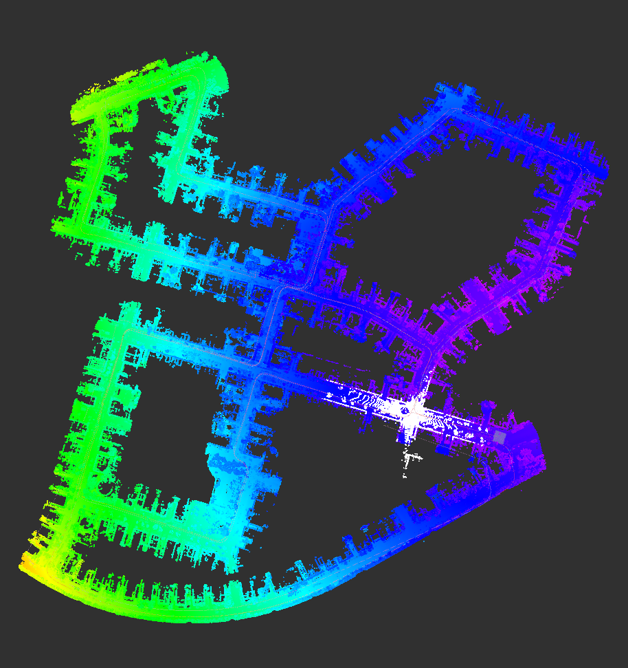
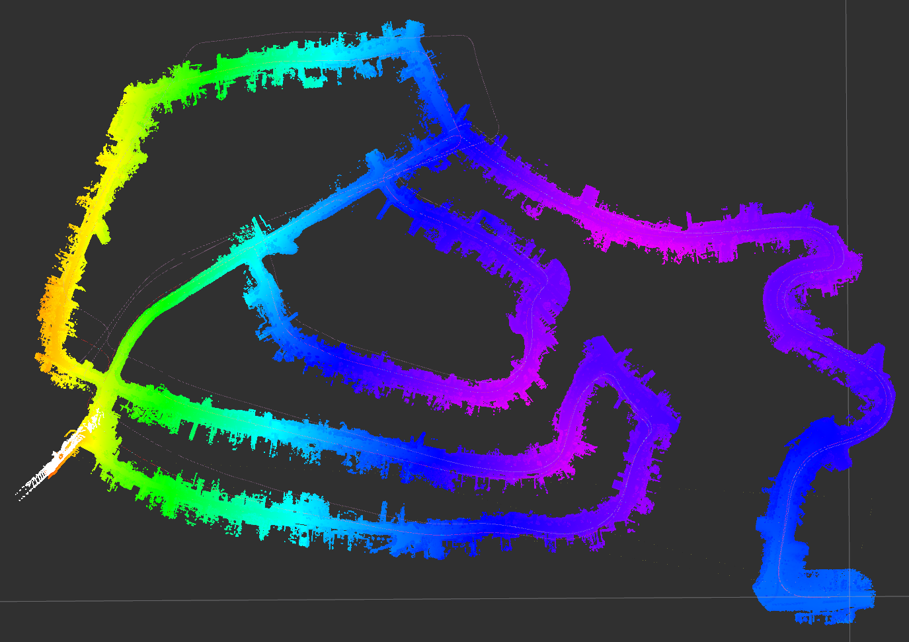
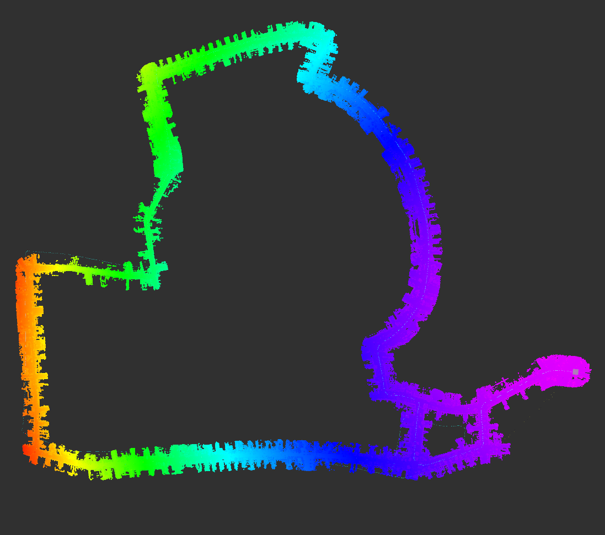

===============
Examples
===============

We provide ready-to-use launch files for some datasets.

KITTI
-----------

.. list-table:: KITTI maps
   :widths: 35 45 35
   :header-rows: 1

   * - |pic1|
     - |pic2|
     - |pic3|
   * - sequence 00
     - sequence 02
     - sequence 17

   

   

   

There is a launch file that you can use to reproduce some of the images above. You can run it with:

.. code-block:: console

   $ roslaunch open3d_slam_ros kitti.launch

Make sure that you place the rosbag in the data folder and name it *kitti00.bag* or you can enter the path manually in the launch file directly (*open3d_slam_ros/launch/examples/kitti.launch*).
The tuning for velodyne HDL64 sensor used in the dataset is in the *open3d_slam_ros/param/params_velodyne_hdl64.yaml*. For sequences 02 and 17 you might have to increase the loop closure search radius to 40 meters.

TODO add more examples
