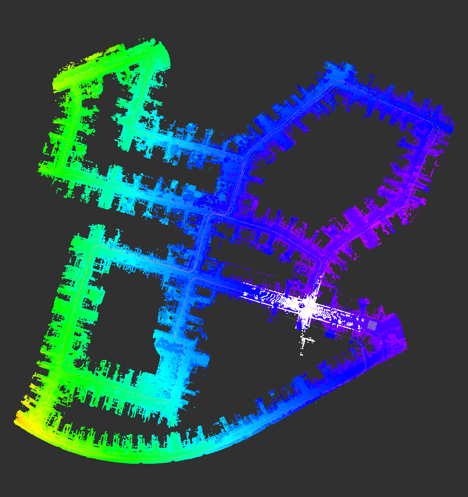
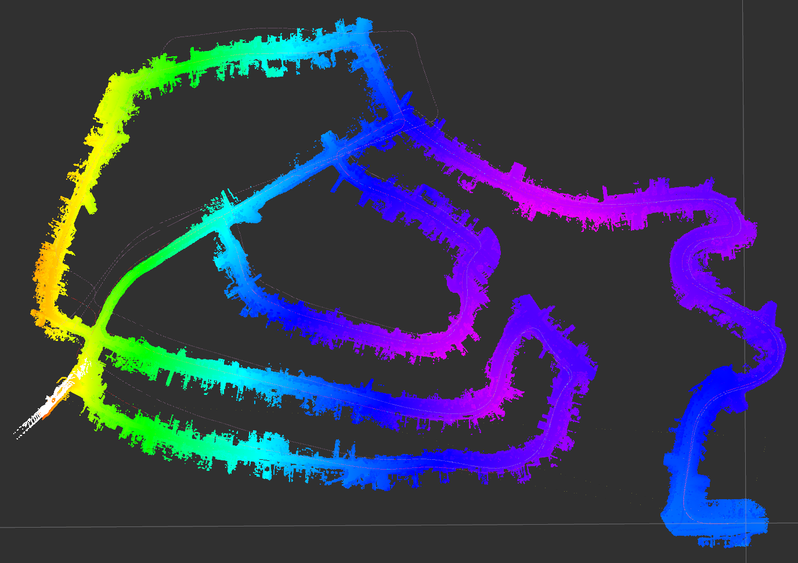
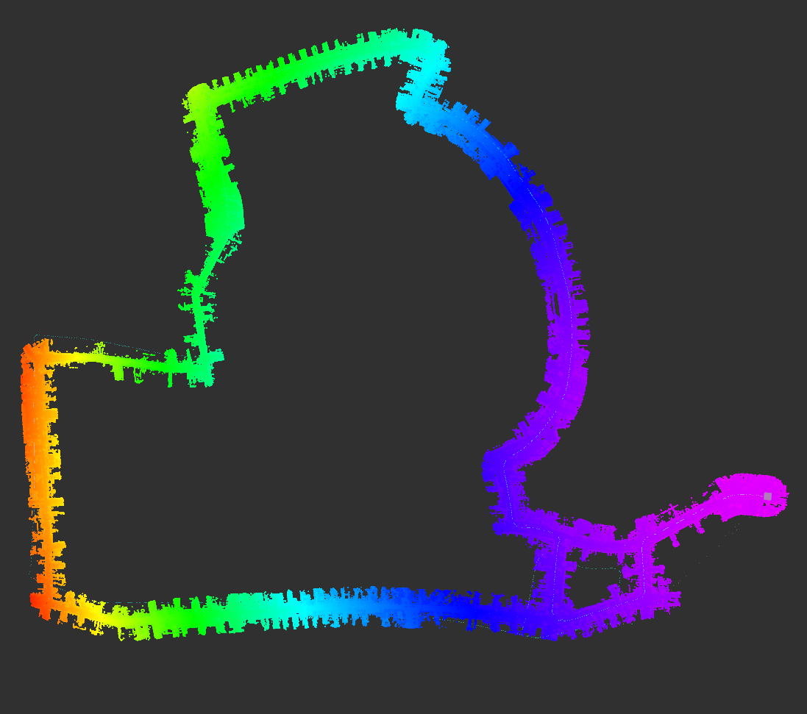

===============
Examples
===============
We provide parameter files and launch recipes for common datasets.

KITTI
-----------

.. list-table:: KITTI maps
   :widths: 35 45 35
   :header-rows: 1

   * - |pic1|
     - |pic2|
     - |pic3|
   * - sequence 00
     - sequence 02
     - sequence 17

   

   

   

To reproduce sequence 00 with a ROS 2 bag, run:

.. code-block:: console

   $ ros2 launch open3d_slam_ros mapping_rosbag.launch.py \
       rosbag_filepath:=/absolute/path/to/kitti00 \
       cloud_topic:=/velodyne_points \
       parameter_filename:=param_velodyne_hdl64.yaml

The tuning for the Velodyne HDL64 sensor used in KITTI is in ``open3d_slam_ros/param/param_velodyne_hdl64.yaml``. For sequences 02 and 17 you might have to increase the loop-closure search radius to 40 meters.

TODO add more examples
